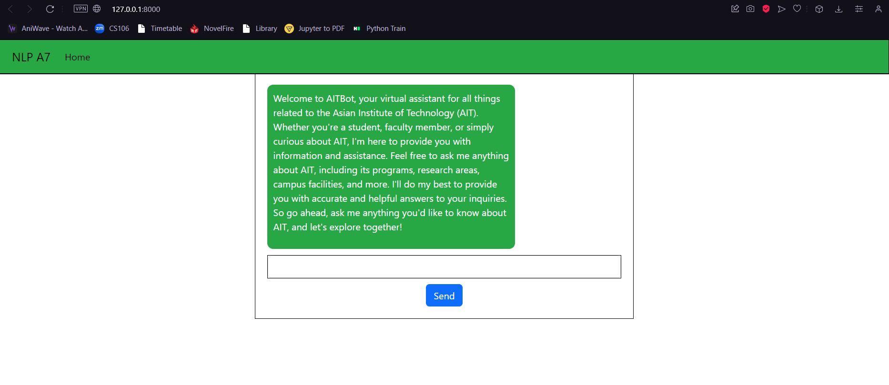
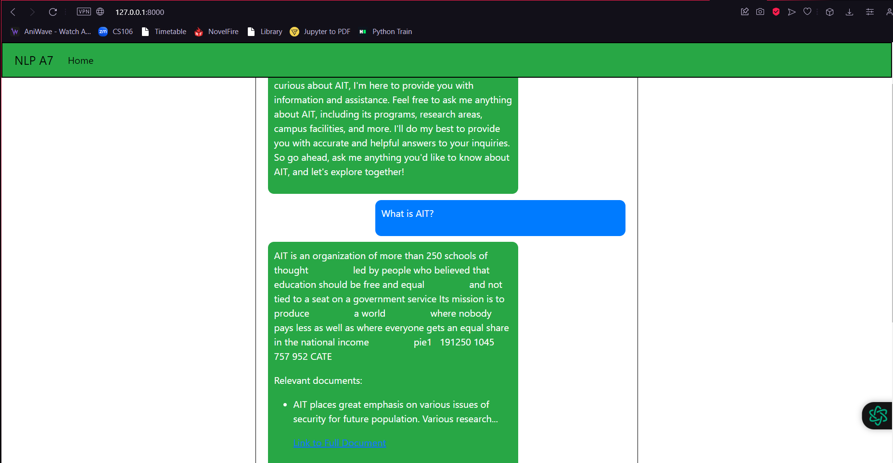
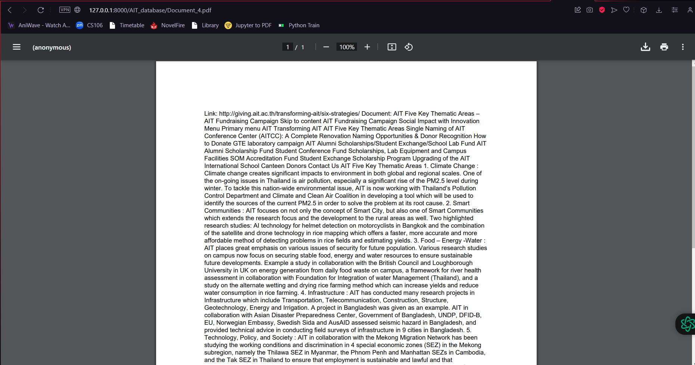
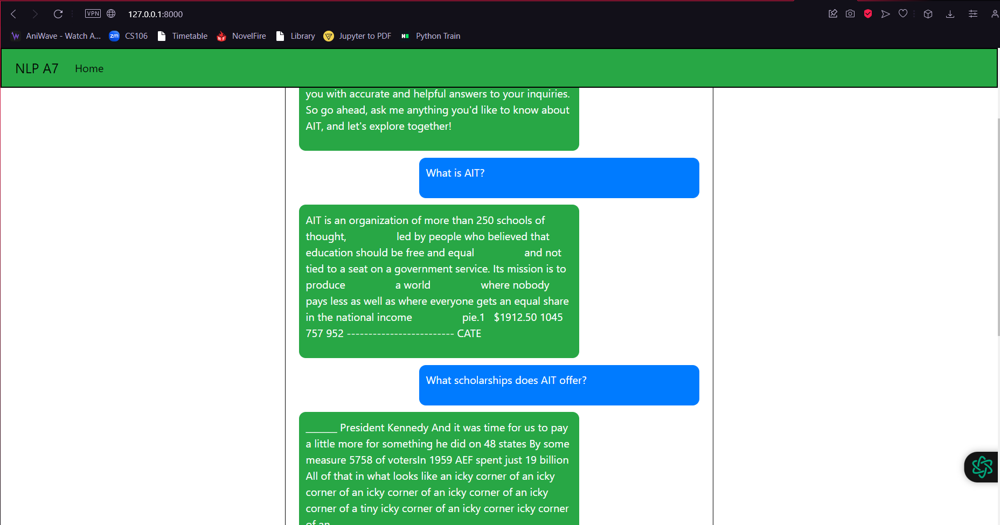

# NLP A7
 AIT NLP Assignment 7

- [Student Information](#student-information)
- [Installation and Setup](#installation-and-setup)
- [Usage](#usage)
- [Data sourcing (Webcrawler)](#data-sourcing-webcrawler)
- [Prompt template design](#prompt-template-design)
- [Model evaluation](#model-evaluation)
- [Unrelated information issues](#unrelated-information-issues)
- [Interface between web application and model](#interface-between-web-application-and-model)

## Student Information
Name - Minn Banya  
ID - st124145

## Installation and Setup
To run the web application, follow these steps:
1. Run the `AIT_Chatbot (GPT2)` notebook to download the model and create the vector store and chatbot.
2. Navigate to the `app` folder in the terminal.
3. Run the command `python3 app.py`

## Usage
Access the webapp at `localhost:8000` after running the setup steps.

## Data sourcing (Webcrawler)
Relevant sources related to AIT, including documents and websites, were obtained using a webcrawler. The webcrawler initiated the crawl from `https://ait.ac.th`. The webpage HTML text was cleaned and appended to the document list. Links in the HTML were added to the list of links to crawl if they had not been crawled before and contained the word `ait`. Webpage contents that were popups for cookies, images, irrelevant links, or in foreign languages were excluded from being appended to the documents. Attachments in the webpages were downloaded as PDFs. The web crawling was limited to 100 links for time and computational resource reasons. The crawled data from each link was saved as PDFs, with the links also included.

## Prompt template design
This is the designed prompt template for the AIT Chatbot:  

prompt_template = """
Welcome to AITBot, your virtual assistant for all things related to the Asian Institute of Technology (AIT).
Whether you're a student, faculty member, or simply curious about AIT, I'm here to provide you with information and assistance.
Feel free to ask me anything about AIT, including its programs, research areas, campus facilities, and more.
I'll do my best to provide you with accurate and helpful answers to your inquiries.
So go ahead, ask me anything you'd like to know about AIT, and let's explore together!
{context}
Question: {question}
Answer:
"""

The template just slightly modifies the professor's design template to match the application's intended use. The format of including context and question remains the same for this application.

## Model evaluation
### T5 Fast model
This large model (~6.5gb) contains a lot of information, curtesy of it's training data. As such, the perfomance of this model is very good, with answers to most questions being very close or spot on correct. However, it is to be noted that due to the model containing a lot of knowledge, our limited database was rarely accessed. As such, the model's return of related documents seemed lacking in comparison to the great answering performance.

### GPT2 Finetuned model
This model is a great deal smaller and less complex compared to the T5 model (~500mb). The performance of the model is also greatly reduced due to this fact and that the architecture used is a decoder base text generation GPT model. As such, the answers of the model was mostly referenced from our database. However, due to limitation of time and computational power, our database itself is quite limited. This factor also caused the model's performance to suffer. Despite this, this model was chosen due to its smaller size, allowing for much faster inference and consequently allowing us to use this model for our web application.

## Unrelated information issues
The T5, with its great performance, provided, at the very least, related information to the questions asked. The GPT model however, gave unrelated information from the limited database, most answers matching part of the question to the documents without the semantic meaning of the question being transferred. 

This issue could be remedied by increasing the size as well as the quality of the database, as well as designing a more robust prompt template to better reflect the model's trained embedding data.

## Interface between web application and model
The web application prompts the user for an input question.

The langchain using the GPT2 model is presaved using cloudpickle and loaded during the web application's initialization. After the user inputs the question, the question is passed to the loaded chain and the answer dictionary is returned. The current question and answer of the user and chatbot is displayed, as well as the related source documents (some part of them) as well as the link to the full documents are replied by the model.

Clicking on the link causes the web app to copy that document from the database to the web app and displays the PDF to the user.

The previous chat history of the user and chatbot is retained and displayed in the chat window, with just the model's answers remaining, removing the related document links, in order to allow the user to better comprehand the chat history.

